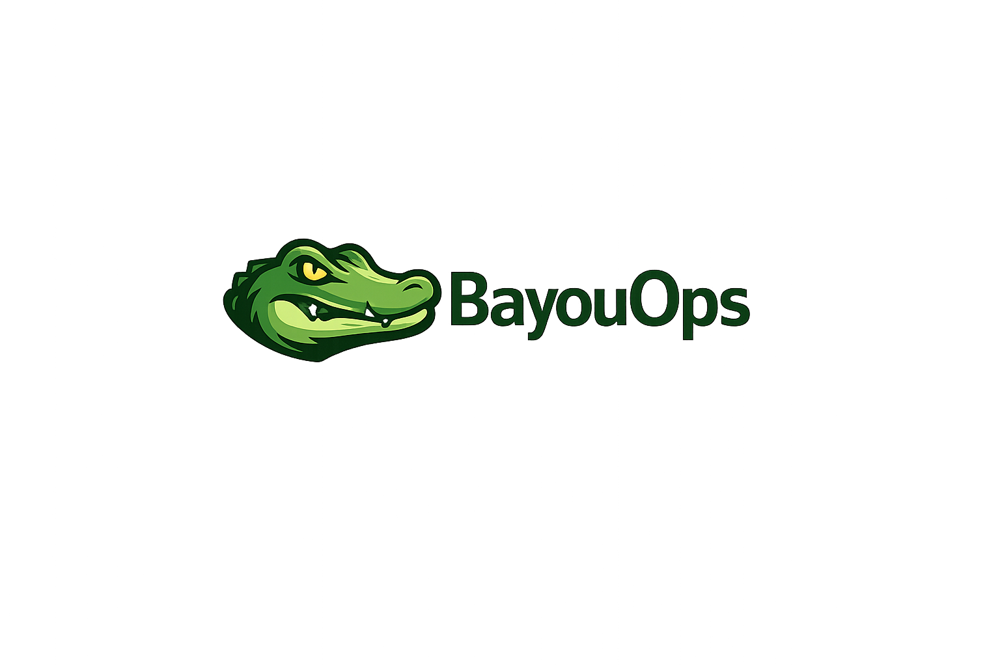
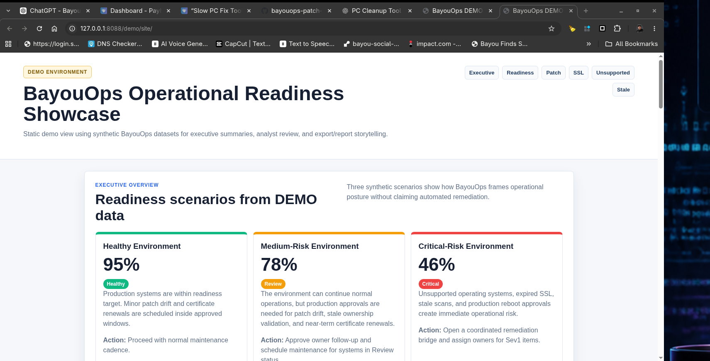
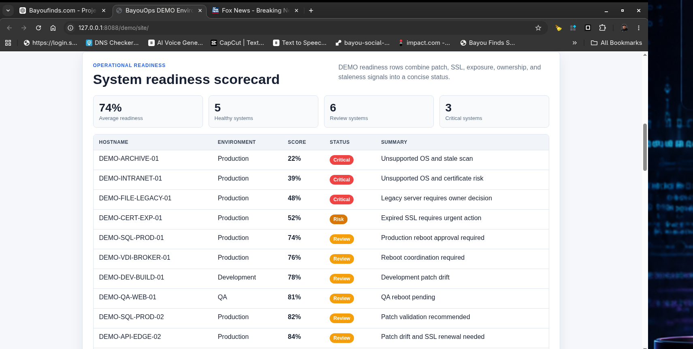
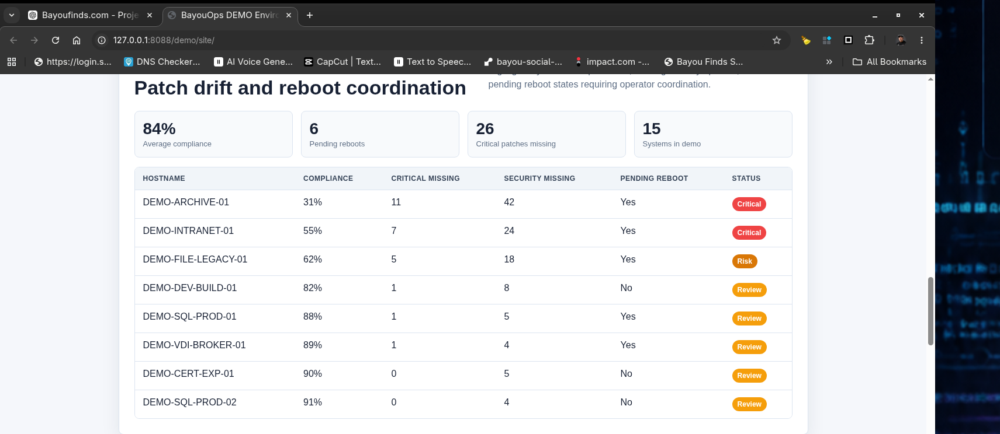
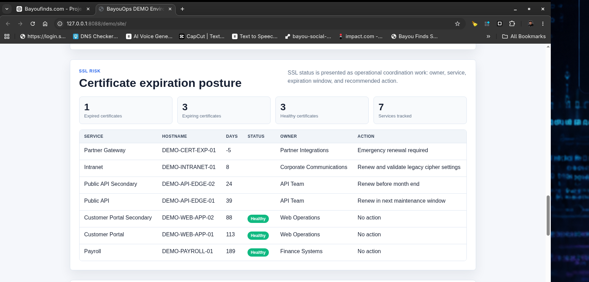
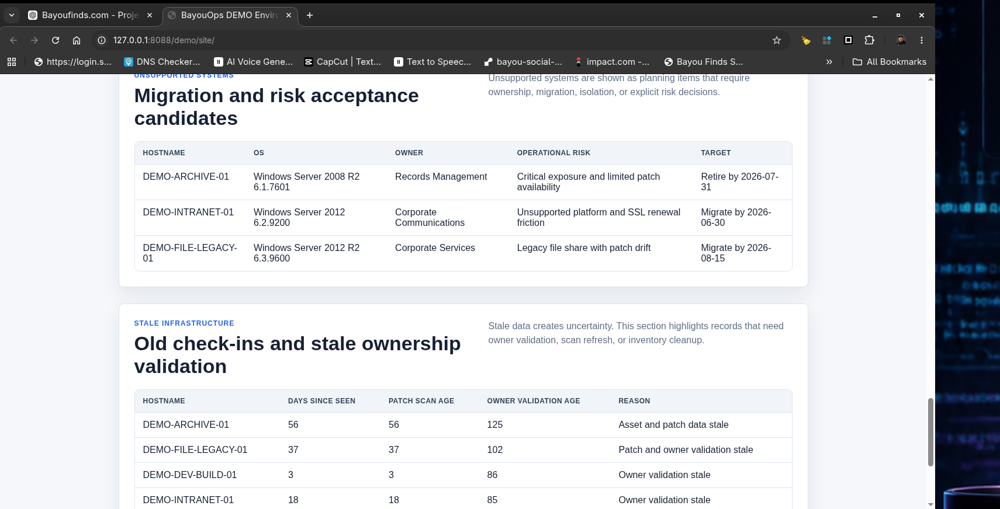

# BayouOps

<p align="center">
  
</p>

<p align="center">
Operational Coordination Intelligence for Infrastructure Teams
</p>

---

## What BayouOps Is

BayouOps is a lightweight, local-first operational readiness tool for infrastructure teams. It helps teams turn inventory, ownership, patch posture, SSL status, exposure findings, and operational notes into dashboards and worklists.

The goal is practical coordination before maintenance windows, outages, bridge calls, and executive reviews.

BayouOps is intended to be understandable to:

- Sysadmins who need fast operational context before touching servers.
- MSP operators who need owner-aware worklists and repeatable customer review artifacts.
- IT managers who need concise readiness and risk summaries.
- Recruiters or reviewers who want to understand the engineering shape of the project quickly.

## What BayouOps Demonstrates

BayouOps is a lightweight operational readiness and infrastructure visibility platform focused on:

- operational posture awareness
- patch readiness tracking
- SSL expiration visibility
- unsupported system identification
- stale infrastructure detection
- executive-facing operational summaries

The project intentionally avoids remediation claims or heavy automation assumptions and instead focuses on practical operational visibility and review workflows.

## Executive Readiness Overview



## What BayouOps Is Not

BayouOps is not:

- SCCM, Intune, BigFix, RMM, SIEM, or a vulnerability scanner.
- Endpoint control software.
- Intrusive monitoring software.
- A patch deployment engine.
- A reboot automation platform.
- A remediation system.

BayouOps is designed for visibility, coordination, and decision support.

## Current Capabilities

- CSV inventory and operational context import.
- Ownership, site, rack, maintenance window, and escalation context.
- Asset lookup by hostname, owner, environment, platform, or notes.
- Patch readiness and pending reboot reporting.
- SSL, exposure, stale system, and unsupported OS demo data.
- Readiness scoring and executive scenario examples.
- Static HTML dashboards and CSV exports.
- Local-only serving by default on `127.0.0.1`.
- Dependency-light scripts using Node.js, Bash, PowerShell, and Python's built-in static file server.

## Core Workflow

```text
Inventory / Context CSV
  -> Import and normalize data
  -> Collect platform and readiness evidence
  -> Correlate findings and ownership
  -> Score operational readiness
  -> Generate dashboards, worklists, and exports
```

Common commands:

```bash
npm test
npm start
npm run serve
npm run build-release
node tools/query-assets.mjs SQL-PROD-01
```

## Local-First Operation

BayouOps runs from local scripts and local files. Inventory imports, generated reports, exports, and operational snapshots stay in the working directory unless an operator intentionally moves or publishes them.

Runtime host and port can be overridden with environment variables:

```bash
BAYOUOPS_HOST=127.0.0.1 BAYOUOPS_PORT=8088 npm run serve
```

Operators may also copy `config/bayouops.env.example` to `config/bayouops.env` for local settings. Local runtime overrides should not be committed.

## Operational Safety Philosophy

BayouOps does not patch systems, reboot systems, modify services, change registry values, enforce policies, or perform remediation.

Generated reports may contain hostnames, ownership details, maintenance windows, escalation contacts, and operational posture. Treat those outputs as operationally sensitive.

Local serving defaults to `127.0.0.1` so dashboards are available to the operator on the local machine without exposing reports to the wider network. Use a broader bind address only when there is a deliberate operational reason and the surrounding network controls are understood.

## Screenshots

Recommended GitHub screenshot order:

1. Executive operational view: `screenshots/executive-operational-view.png`
2. Approval-required query: `screenshots/operational-query-approval-required.png`
3. NOC operational view: `screenshots/noc-operational-view.png`
4. Query CSV export: `screenshots/operational-query-csv-export.png`
5. Control menu: `screenshots/BayouOps_Control_Menu_v1.png`
6. Readiness dashboard: `screenshots/operational-readiness-dashboard-v2.png`
7. Exposure dashboard: `screenshots/BayouOps_Exposure_Dashboard_v1.png`
8. Trend dashboard: `screenshots/BayouOps_Trend_Intelligence_Dashboard_v1.png`

See `docs/SCREENSHOT_GUIDE.md` for placement guidance and capture notes.

## Demo Environment

Synthetic demo assets live under `demo/`. Demo records are explicitly marked `DEMO` and are separate from runtime `data/`, `samples/`, `incoming/`, `exports/`, and generated output folders.

The demo environment includes:

- Server inventory
- Patch compliance
- SSL status
- Exposure findings
- Readiness scoring
- Stale system examples
- Unsupported OS examples
- Healthy, medium-risk, and critical-risk executive scenarios

Start with `demo/README.md`, then use `docs/DEMO_WALKTHROUGH.md` for a guided presentation path.

## Demo Assets

BayouOps Suite Pro includes a local-only synthetic demo asset pack for product screenshots, README visuals, Payhip sales assets, and walkthroughs. It contains healthy, medium-risk, and critical scenarios plus Windows audit, Linux health, patch readiness, SSL forecast, AD privileged access, and exportable evidence examples.

```bash
npm run demo:seed
npm run demo:exports
npm run demo:serve
```

The screenshot-ready dashboard is generated at `demo/dashboards/DEMO_executive-dashboard.html` and is designed for a 1280x720 capture. Demo data and exports are written under `demo/data/` and `demo/exports/`; `demo/screenshots/` is reserved for captured product-page images.

All demo records are synthetic and marked as demo data. The demo server binds to `127.0.0.1` by default, makes no cloud calls, and includes no real credentials.

## Additional Operational Views

### Critical Risk Scenario



### Patch Compliance Visibility



### SSL Risk Tracking



### Unsupported & Stale Infrastructure



## Operational Narratives

BayouOps is built around practical operational narratives:

- Patch drift: which systems are behind target and who owns the follow-up.
- SSL expiration risk: which services are near expiration or already expired.
- Unsupported systems: which assets need migration, isolation, or explicit risk acceptance.
- Stale infrastructure: which systems have old check-ins, stale patch scans, or stale ownership validation.

These narratives are documented in `docs/DEMO_WALKTHROUGH.md` and summarized for non-technical audiences in `docs/EXECUTIVE_SUMMARY.md`.

## Documentation

- `docs/ARCHITECTURE.md` - project architecture and processing flow.
- `docs/SECURITY_MODEL.md` - trust boundary, data sensitivity, and safety model.
- `docs/SCREENSHOT_GUIDE.md` - screenshot placement and capture recommendations.
- `docs/DEMO_WALKTHROUGH.md` - guided demo path and operational narratives.
- `docs/EXECUTIVE_SUMMARY.md` - concise manager-facing project summary.
- `docs/SAFETY.md` - core safety principles.
- `docs/LIMITATIONS.md` - current product limitations.
- `docs/ROADMAP.md` - planned direction and out-of-scope items.

## Review Notes

BayouOps is intentionally small. It favors readable scripts, local files, static dashboards, and explicit operator review over hidden services or broad automation.
