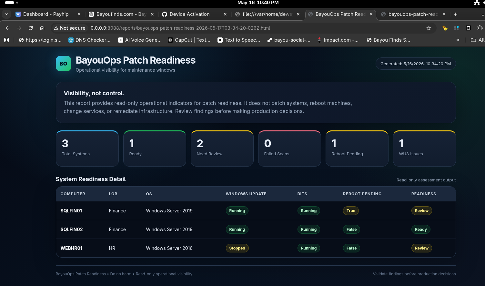

# BayouOps Patch Readiness

Read-only operational visibility tooling for Windows patch maintenance readiness.

Built from real-world enterprise maintenance window experience where operational visibility and readiness validation are critical before patch execution.

Current Version: v0.1.0-alpha

---

## Dashboard Preview

---

## Core Philosophy

Visibility, not control.

BayouOps Patch Readiness provides operational indicators for maintenance readiness without modifying infrastructure.

This tool does NOT:
- patch systems
- reboot machines
- modify services
- remediate systems
- perform failovers

It provides visibility so administrators can make informed operational decisions.

---

## Current MVP Features

- CSV inventory import
- Windows Update service visibility
- BITS service visibility
- reboot pending detection
- HTML dashboard reporting
- inventory hygiene validation
- operational documentation

---

## Documentation

- docs/ROADMAP.md
- docs/CHECKS.md
- docs/LIMITATIONS.md
- docs/SAFETY.md

---

## Safety Principles

- Do no harm
- Read-only first
- Visibility over control
- Warn, don’t force
- Document, don’t assume

---

## Status

Public MVP / active development phase.

Windows validation required before commercial release.

---

## Disclaimer

BayouOps Patch Readiness is an operational visibility aid only.

Administrators remain responsible for validating findings and making production decisions.

