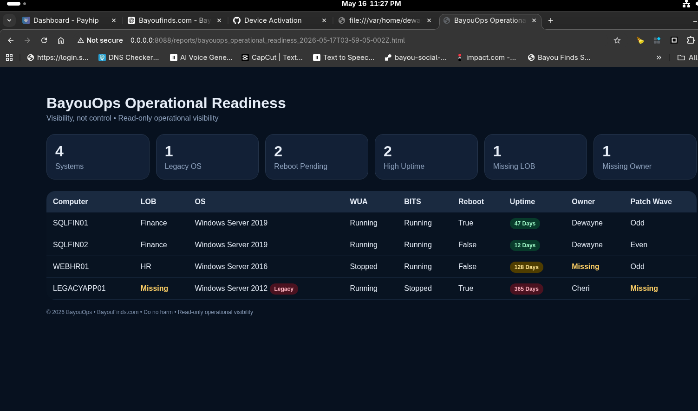

# BayouOps Patch Readiness

BayouOps Patch Readiness is a lightweight operational visibility platform focused on maintenance readiness, governance hygiene, and CAB-friendly operational reporting.

The platform is intentionally:

- read-only
- lightweight
- operationally focused
- exportable
- CAB-friendly
- governance aware

BayouOps does NOT:

- patch systems
- reboot endpoints
- deploy software
- modify infrastructure
- perform remediation actions

Its purpose is visibility, not control.

---

## Operational Readiness Dashboard

BayouOps provides operational visibility into:

- maintenance readiness
- reboot exposure
- governance gaps
- inventory hygiene
- operational drift
- legacy operating system visibility
- ownership validation

### Example Dashboard

---

## Current Visibility Indicators

- Windows Update service status
- BITS service status
- reboot pending systems
- missing ownership metadata
- missing LOB assignment
- legacy operating system detection
- high uptime visibility
- patch wave visibility
- duplicate hostname detection
- operational readiness scoring concepts
- CAB/export-friendly reporting

---

## Design Philosophy

BayouOps follows a simple principle:

> Visibility, not control.

The goal is to help operational teams:

- identify maintenance blockers
- reduce CAB friction
- improve operational awareness
- simplify audit discussions
- surface governance issues
- improve maintenance planning

without introducing unnecessary infrastructure risk.

---

## Example Use Cases

- CAB preparation
- patch readiness reviews
- governance reporting
- operational hygiene validation
- maintenance wave planning
- audit preparation
- operational readiness exports
- management visibility dashboards

---

## Export Capabilities

Current outputs include:

- HTML dashboards
- printable operational reports
- PDF export support through browser print engines

---

## Project Status

Current phase:

- MVP operational dashboards
- inventory normalization engine
- validation engine
- severity dashboarding
- flexible CSV header mapping
- governance visibility indicators

Future roadmap concepts:

- operational readiness scoring
- trend comparison dashboards
- historical reporting
- bell/notification UX
- ServiceNow-friendly export workflows
- executive summary dashboards

---

## License

© 2026 BayouOps • BayouFinds.com

All Rights Reserved.
